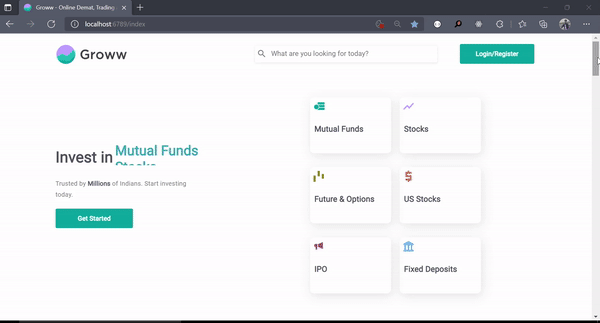
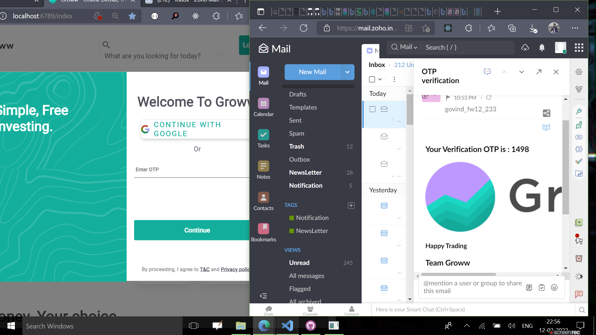
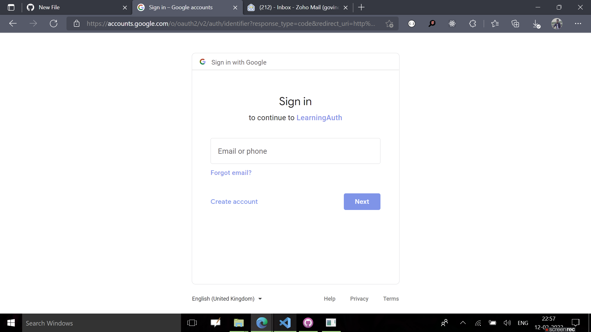
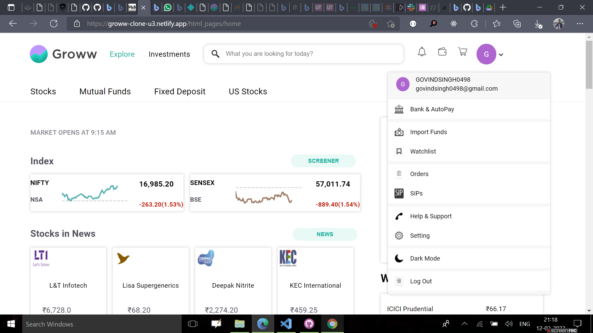
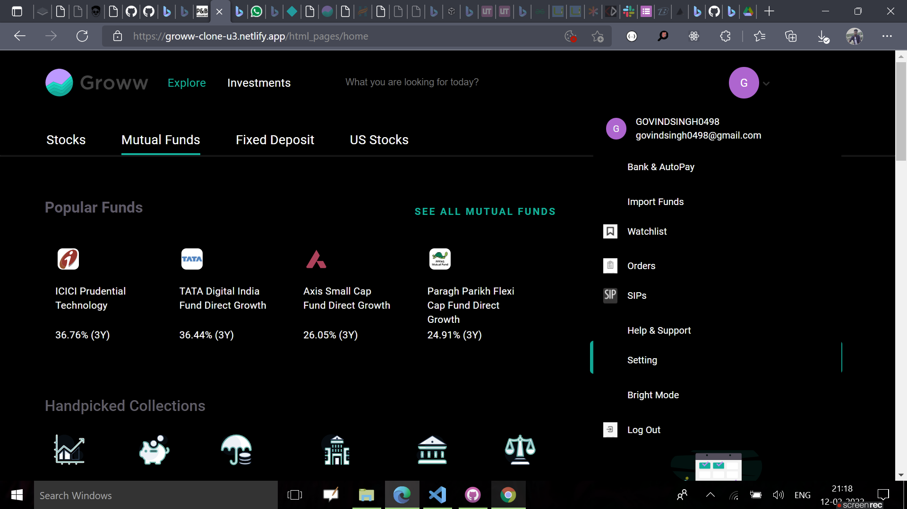
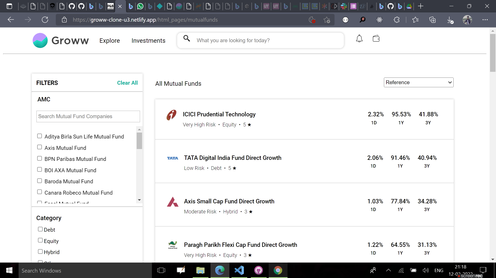
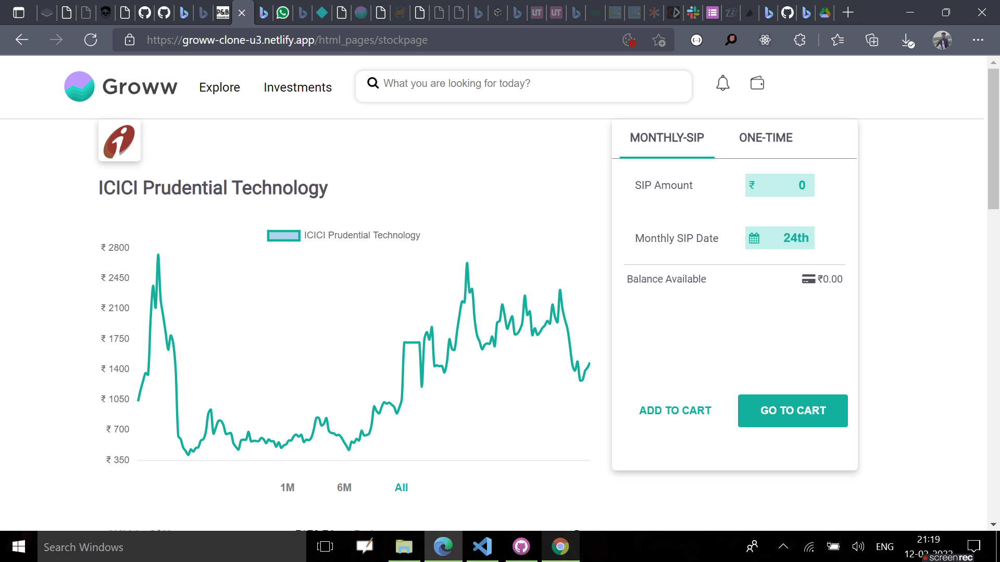
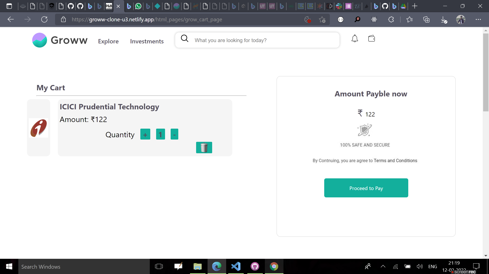
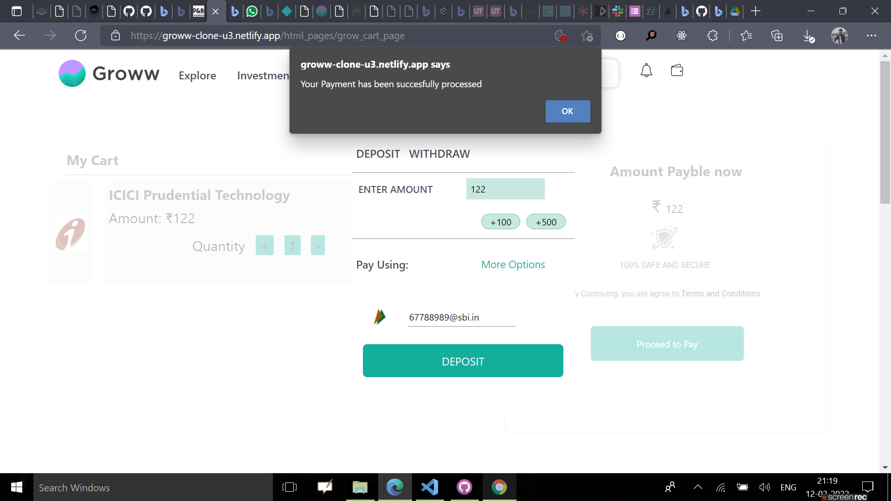

# Groww-Clone-Backend
Groww is an investing platform where users can find the best mutual funds to invest in and can invest their money without any hassles. This was a Backend collaborative project implemented using Ejs,Node js,Exress js,gauth,Redis js,Chart js,CSS,Tilt Js and Mongo Db.
# Preview

# Features

User Authentication Login through OTP 

Google Authentication

Home

Dark Mode

Products

Products Details

Cart

Payment Successfull

# Getting Started

<h4>Want to run in your local Machine? Great!<h4>

<h4>To run, follow these steps:</h4>

  <ul>
    <li>Clone my repository https://github.com/Jerry-29/Groww-Clone-Backend</li>
    <li>Open that code in your Code Editor</li>
    <li>Run 'npm install'</li>
    <li> Run Redis server</li>
    <li>Run 'npm run server' to Run Project</li>
    <li>Open your Browser and go to 'localhost:6789/index'</li>
    <li>Thats all !</li>
  </ul>
  
  # TechStacks
  <ul>
  <li>Ejs</li>
  <li>CSS</li>
  <li>Advance Javascripts</li> 
  <li>Node js</li>
  <li>Express js</li>
  <li>Redis</li>
  <li>gauth2.0</li>
  <li>Chart js</li>
  <li>Vanilla-tilt.js</li>
  </ul>
  
  # Developers
<ul>
  <li><a href="https://github.com/Jerry-29">Govind Singh</a>
  </li>
   <li>
     <a href="https://github.com/sayanwastaken">
     Sayan Das
       <a/>
  </li>
   <li>
     <a href="https://github.com/29ab">
     Abhishek Chauhan
     </a>
  </li>
   <li>
     <a href="https://github.com/mayurjadhav09">
     Majur Jadhav
     </a>
  </li>
   <li>
     <a href="https://github.com/MohitGupta10">
     Mohit Gupta
     </a>
  </li>
  </ul>
